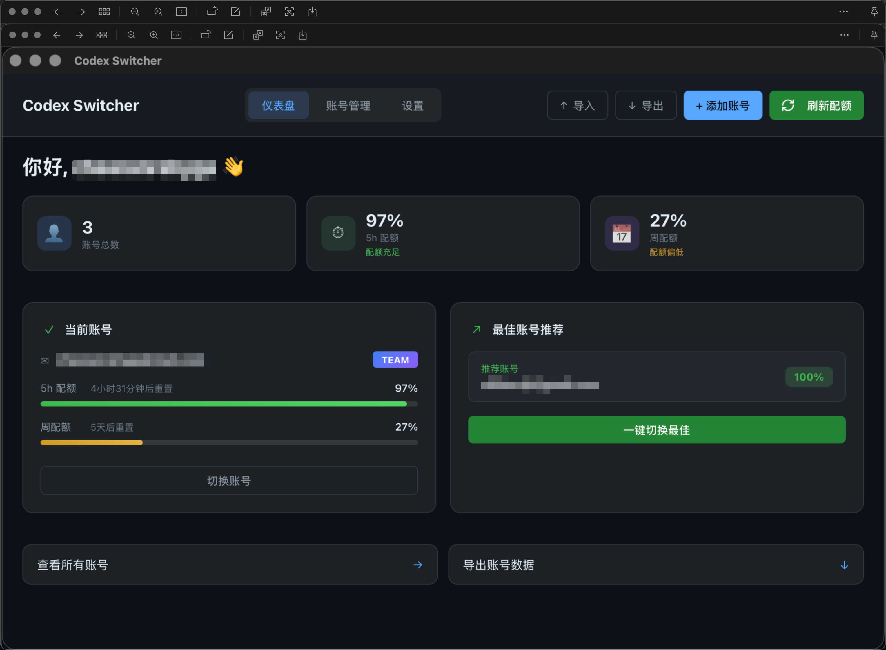
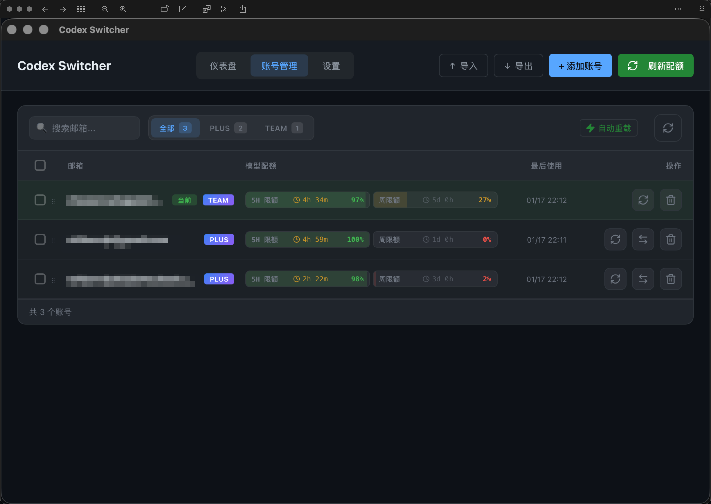
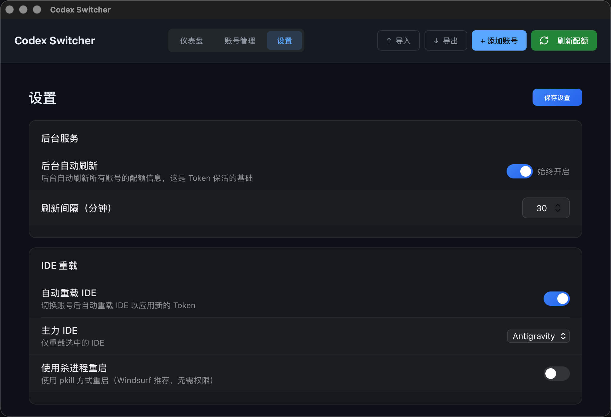

# Codex Switcher

[English](#english) | [中文](#中文)

---

## English

A fast and elegant account switching tool for Codex CLI and VS Code based IDEs (Windsurf, Antigravity, Cursor).

### Features

- 🔄 **Quick Account Switch** - Switch between multiple Codex accounts with one click
- 📊 **Quota Dashboard** - Real-time display of 5-hour and weekly quota usage
- 🔐 **OAuth Login** - Secure authentication via official Codex OAuth flow
- 🔄 **Auto Token Refresh** - Background scheduler keeps tokens alive automatically
- 💻 **IDE Auto-Reload** - Automatically reload IDE after account switch (supports Windsurf, Antigravity, Cursor, VS Code, Codex CLI)
- 🖥️ **System Tray** - Runs in background, click tray icon to show window
- 📦 **Import/Export** - Backup and restore account data

### Installation

#### macOS

Download the latest `.dmg` from [Releases](https://github.com/xtftbwvfp/codex-switcher/releases), open it and drag to Applications.

#### Build from Source

```bash
# Install dependencies
npm install

# Run in development mode
npm run tauri dev

# Build for production
npm run tauri build
```

### Tech Stack

- **Frontend**: React + TypeScript + Vite
- **Backend**: Tauri 2.x + Rust
- **Styling**: CSS with dark theme

### License

MIT License - see [LICENSE](LICENSE) file.

---

## 中文

一个快速优雅的 Codex CLI 和 VS Code 系 IDE（Windsurf、Antigravity、Cursor）账号切换工具。

### 功能特性

- 🔄 **快速切换账号** - 一键切换多个 Codex 账号
- 📊 **配额仪表盘** - 实时显示 5 小时和周配额使用情况
- 🔐 **OAuth 登录** - 通过官方 Codex OAuth 流程安全认证
- 🔄 **自动刷新 Token** - 后台调度器自动保持 Token 有效
- 💻 **IDE 自动重载** - 切换账号后自动重载 IDE（支持 Windsurf、Antigravity、Cursor、VS Code、Codex CLI）
- 🖥️ **系统托盘** - 后台运行，点击托盘图标显示窗口
- 📦 **导入/导出** - 备份和恢复账号数据

### 安装

#### macOS

从 [Releases](https://github.com/xtftbwvfp/codex-switcher/releases) 下载最新的 `.dmg` 文件，打开后拖入 Applications。

#### 从源码构建

```bash
# 安装依赖
npm install

# 开发模式运行
npm run tauri dev

# 生产环境构建
npm run tauri build
```

### 技术栈

- **前端**: React + TypeScript + Vite
- **后端**: Tauri 2.x + Rust
- **样式**: CSS 暗色主题

### 开源协议

MIT License - 详见 [LICENSE](LICENSE) 文件。

---

## Screenshots / 截图





## Contributing / 贡献

Issues and Pull Requests are welcome!

欢迎提交 Issue 和 Pull Request！
